# Интернет магазин
### Реализация бэкенд сервиса Интернет магазина 

В этом проекте раелизован Web API с использованием Django REST framework (в качестве базы данных используется PostgreSQL).

## Запуск проекта

Для развертывания проекта используется `Docker Compose`.

Перед запуском проекта необходимо подготовить env-файл:
```
copy .env-prod .env 
```
Чтобы запустить проект используем команду:
```
docker compose up -d
```

При первом запуске проекта создается база данных. 
Для заполнения её данными используем команду `loaddatautf8`:
```
docker compose exec app python manage.py loaddatautf8 fixtures/data.json
```
Стартовая страница проекта [http://127.0.0.1:80](http://127.0.0.1:80).

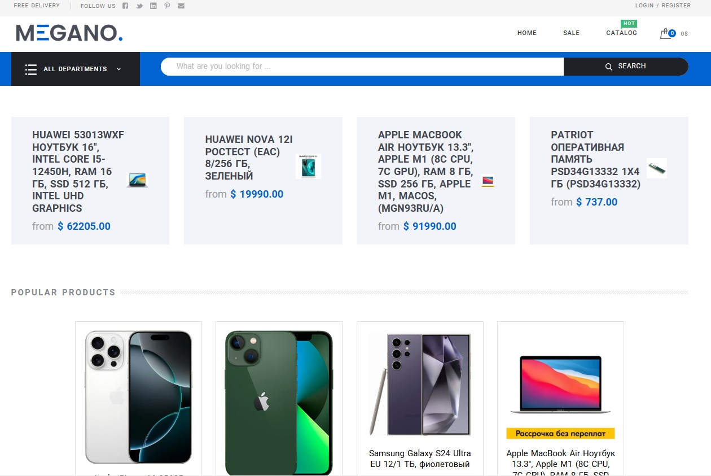

Стартовая страница отображает товары по категориям

На вкладке `Sale` получаем информацию по товарам по скидкам
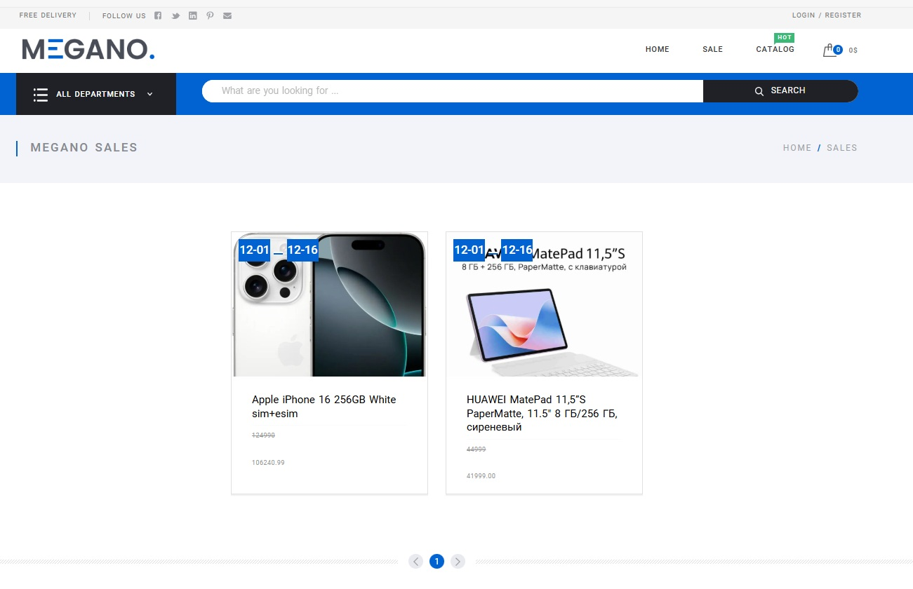

Вход в личный кабинет через меню `LOGIN/REGISTER`

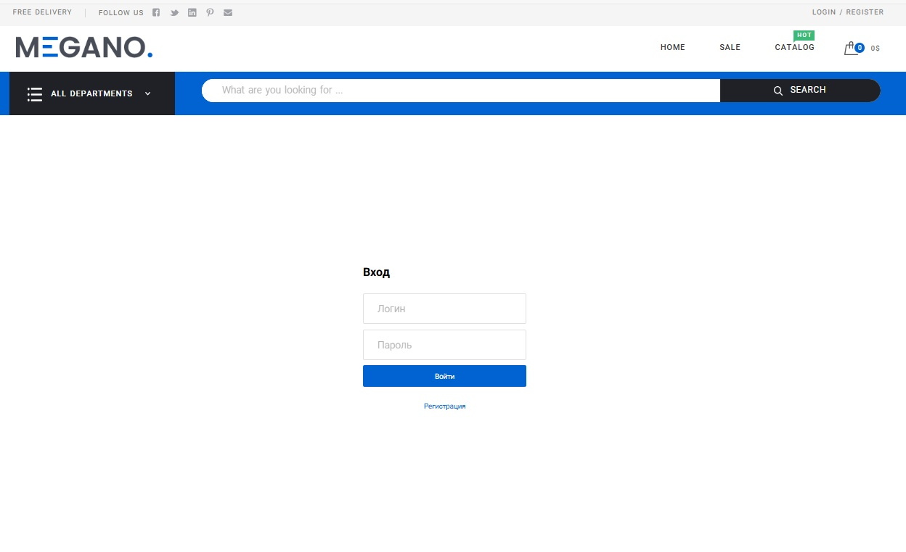

Сдесь же и регистрация нового пользователя

В сервисе зарегистрировано 4 пользователя:
- суперпользователь admin (password: 01097);
- Sem, Tom, jhon (password: 1qaz!QAZ)

Попасть в свой личный кабинет пользователь может кликнув по своему логину, наприме `Sem`

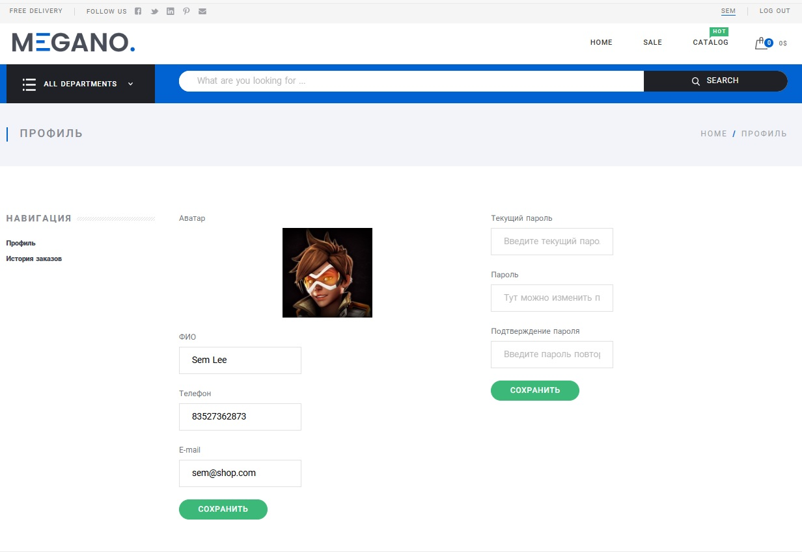

В личном кабинете пользователь может поменять свои данные, аватарку, пароль, а так же посмотреть историю своих покупок
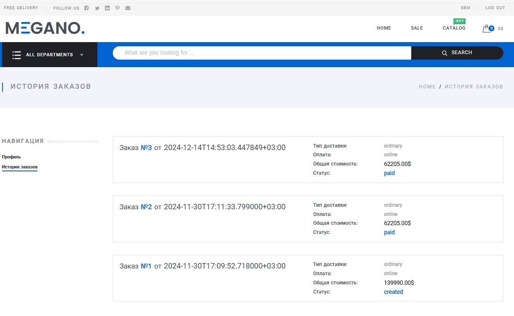 

Товары на сайте можно сортировать по разным параметрам: цена, наличие товара в магазине, бесплатная доставка, по тегам, отзвам, рейтингам и новизне

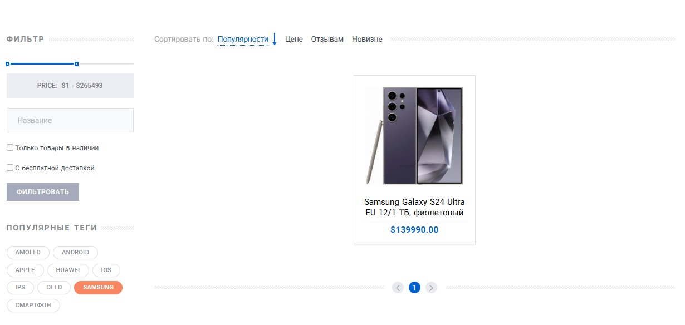

Карточка товара содержит его название, цену, описание, характеристики и отзывы


Здесь мы можем добавить товар в корзину, а затем перейти в неё щелкнув по корзине в верхней правой части меню

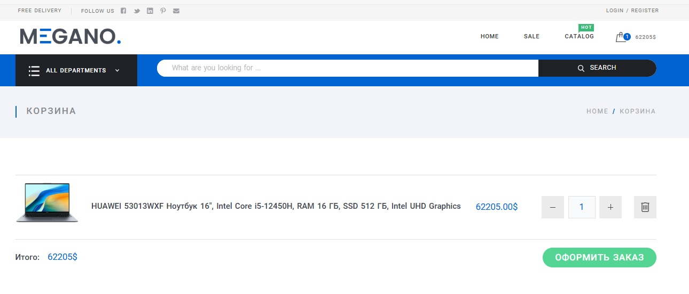

Кнопка `Оформить заказ` запускает процкдуру оформления покупки выбранных товаров. В итоге формируется заказ

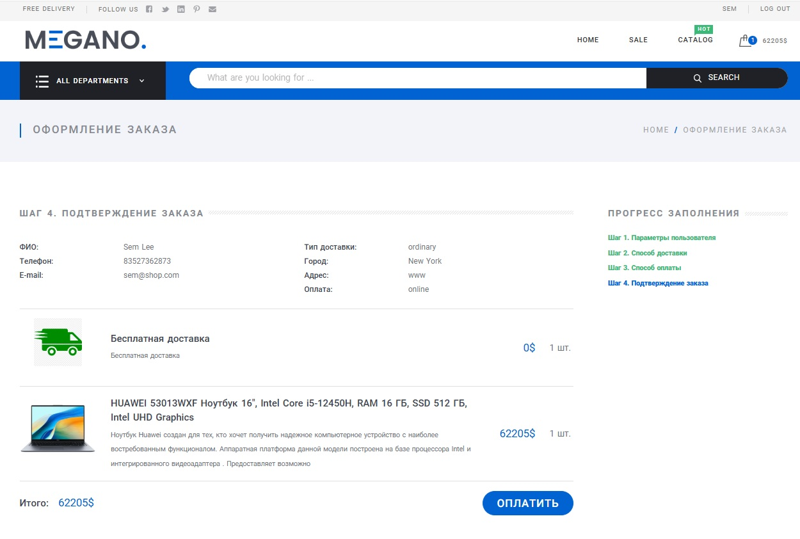

Для завершения покупки заказ необходимо оплатить

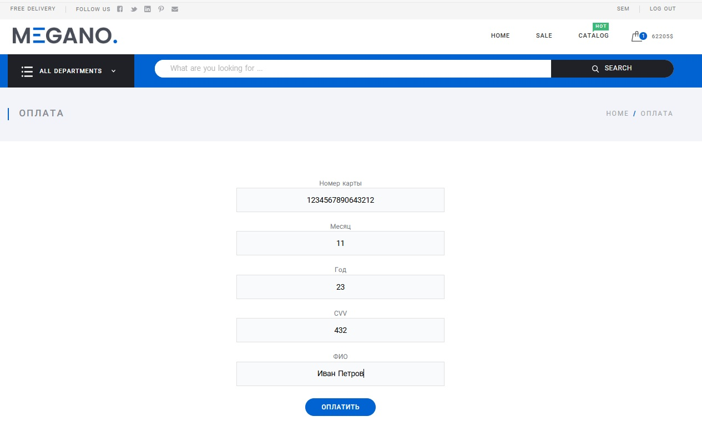

После оплаты пользователю направляется электронное письмо с данными заказа (в проекте используется очередь задачь Celery и имитация отправки сообщений)

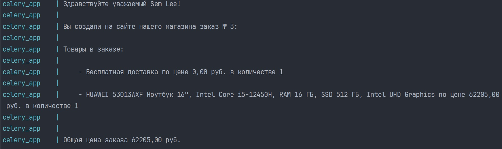

Для контроля работы Celery в проекте развернут сервис Flower [http://127.0.0.1:5555](http://127.0.0.1:5555)

Для работы с каталогами товаров используется панель администратора [http://127.0.0.1:80/admin](http://127.0.0.1:80/admin)

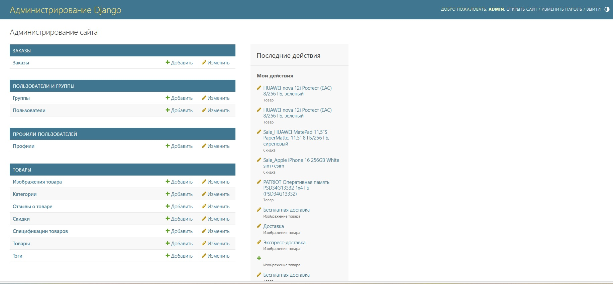


You can send HTTP requests from [http://127.0.0.1:80/api/docs](http://127.0.0.1:80/api/docs).

## Licence

Author: Author: Stanislav Rubtsov